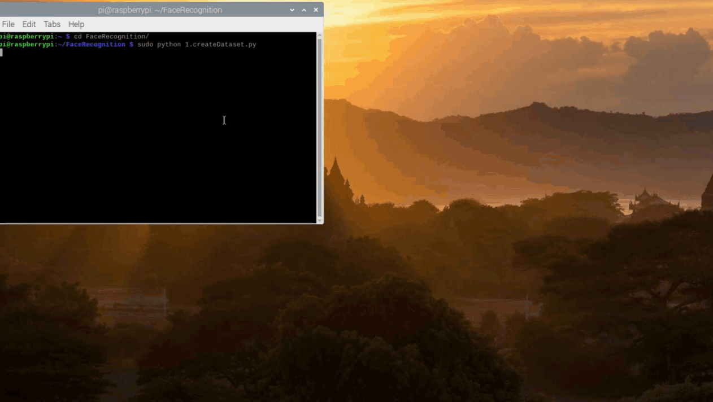
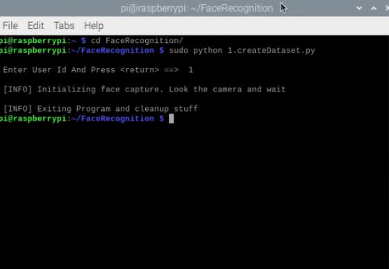
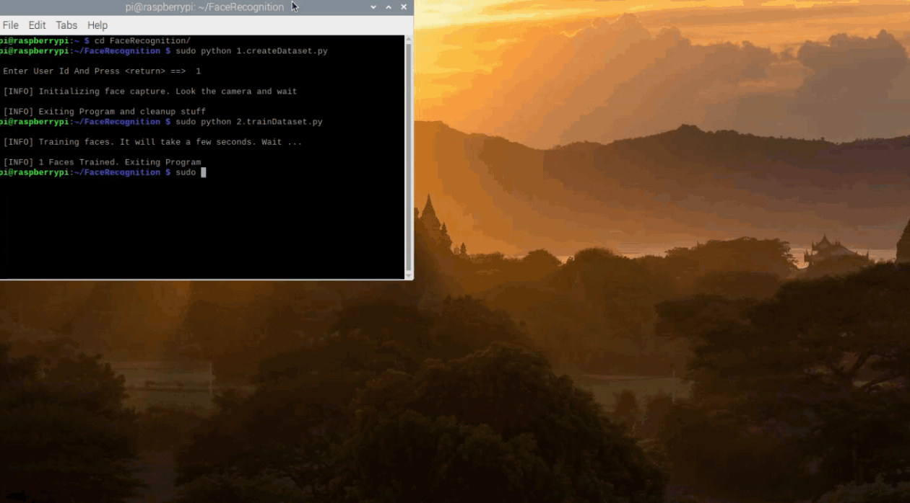

[![MIT License][license-shield]][license-url]
[![LinkedIn][linkedin-shield]][linkedin-url]
[![Instagram][Instagram-shield]][Instagram-url]


<!-- PROJECT LOGO -->
<br />
<p align="left">
  <a >
    
  </a>
</p>

<!-- COLORDETECTION RASPBERRYPI PYTHON -->
# FaceRecognition In RaspberryPi Using Python

<!-- TABLE OF CONTENTS -->
<details open="open">
  <summary>Table of Contents</summary>
  <br />
  <ol>
    <li>
      <a href="#project-details">Project Details</a>
      <ul>
        <li><a href="#built-with">Built With</a></li>
      </ul>
    </li>
    <li>
      <a href="#getting-started">Getting Started</a>
      <ul>
        <li><a href="#opencv-installation">OpenCV Installation</a></li>
        <li><a href="#clone-project">Clone Project</a></li>
      </ul>
    </li>
    <li><a href="#contact-with-me">Contact</a></li>
    <li><a href="#license">License</a></li>
  </ol>
</details>


<!-- ABOUT THE PROJECT -->
## Project Details

Steps To Be Followed

* First, Run the createDataset python file which will help to create the Images of the respective face with an id.
  ```sh
   python 1.CreateDataset.py
   ```
* Secondly, Run the trainDataset python file which will help to train all the faces with respective to an id's initialized.
  ```sh
   python 2.trainDataset.py
   ```
* Finally, Run the recognizeData python file which will help to recognize the face in the Images with the help of id's that are assigned.
  ```sh
   python 3.recognizeData.py
   ```


Output

* Here is the output GIF file on running the 1.CreateDataset.py below.

For a greater accuracy change the below code. This helps to create the dataset with more images so that it helps the trainer to train with more accuracy (Example shown below).

   ```sh
   elif count >= 30: 
      break
   ```

  ```sh
   elif count >= 100: # Any greater number 
      break
   ```

  <a >
    
  </a> 
  
* Here is the output GIF file on running the 2.trainDataset.py below.

  <a >
    
  </a> 
  
* Here is the output GIF file on running the 3.recognizeData.py below. Change the name of the person to the respective name of the trained model (Example shown below). ID should be matched with the ID given while creating the Dataset (i.e., in 1.createDataset.py file).

  ```sh
  # names related to ids: example ==> None: id=0, NameOfthePerson: id=1, X: id=2, etc
  names = ['None', 'NameOfthePerson', 'X', 'Y', 'Z']
   ```
   
   ```sh
  names = ['None', 'VenuDhanekula', 'X', 'Y', 'Z']
   ```

  <a >
    
  </a> 
  


### Built With

Here are the list of the major components that are required to built the above project.
You will be directed to the respective page for purchase / learning.
* [Raspberry Pi](https://www.raspberrypi.org/products/)
* [Pi Camera](https://www.raspberrypi.org/products/camera-module-v2/)
* [Python](https://www.python.org/)

Python Libraries Used.
* [NumPy](https://numpy.org/)
* [Pillow](https://pypi.org/project/Pillow/)
* [Open CV](https://docs.opencv.org/master/d3/df2/tutorial_py_basic_ops.html)


<!-- GETTING STARTED -->
## Getting Started

This is how you can follow the instructions on setting up the project and running the file in the local system.

### OpenCV Installation

1. One line command promt installer.
   ```sh
   pip install opencv-python
   pip install opencv-contrib-python
   ```
2. Complete installation (Below mentioned link gives the detailed information of installing the OpenCV in Raspberry Pi)
   <br />
   
   * [Installation Link](https://robu.in/how-to-install-opencv-in-raspberry-pi/)
   
   <br />
3. Check the Open CV version (Output will be the installed version of the Open CV (i.e., 3.0.0 or 3.1.2)
   ```sh
   import cv2
   print(cv2.__version__)
   ```
### Clone Project

1. get a local copy up and running follow cloning steps.

   ```sh
   git clone https://github.com/VenuDhanekula/FaceRecognition_RaspberryPi_Python.git
   ```
   


<!-- CONTACT -->
## Contact With Me

<p align="left">
<a href="https://instagram.com/venu_abhi" target="blank"> Instagram</a>
  
<br />
  
<a href="https://linkedin.com/in/venu-dhanekula-706518a7" target="blank"> Linkedin</a>
</p>


<!-- LICENSE -->
## License

Distributed under the MIT License. See `LICENSE` for more information.


<!-- MARKDOWN LINKS & IMAGES -->
[license-shield]: https://github.com/VenuDhanekula/LogoImages/blob/main/LicenceMIT_Logo.svg
[license-url]: https://github.com/VenuDhanekula/ColorDetection_RaspberryPi_Python/blob/main/LICENSE

[linkedin-shield]: https://github.com/VenuDhanekula/LogoImages/blob/main/LinkedIn_Logo.svg
[linkedin-url]: https://linkedin.com/in/venu-dhanekula-706518a7

[Instagram-shield]: https://github.com/VenuDhanekula/LogoImages/blob/main/Instagram_Logo.svg
[Instagram-url]: https://instagram.com/venu_abhi
